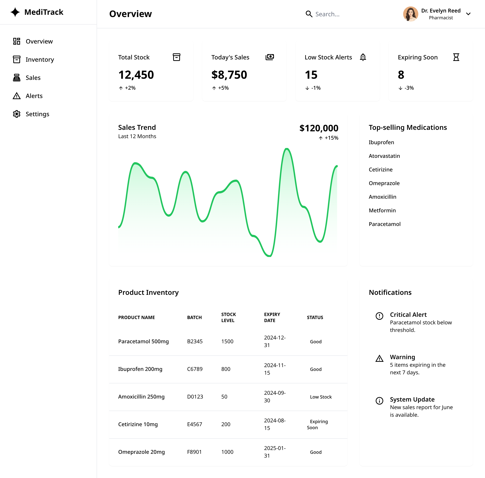

# MediTrack


An internal retail dashboard for a pharmacy tracking statistics and implementing analytics.
Built Using React + Vite, tailwind, and FastAPI.

## Setup
1. Install dependencies
```bash
cd frontend
npm install
```
2. Run development server
```bash
npm run dev